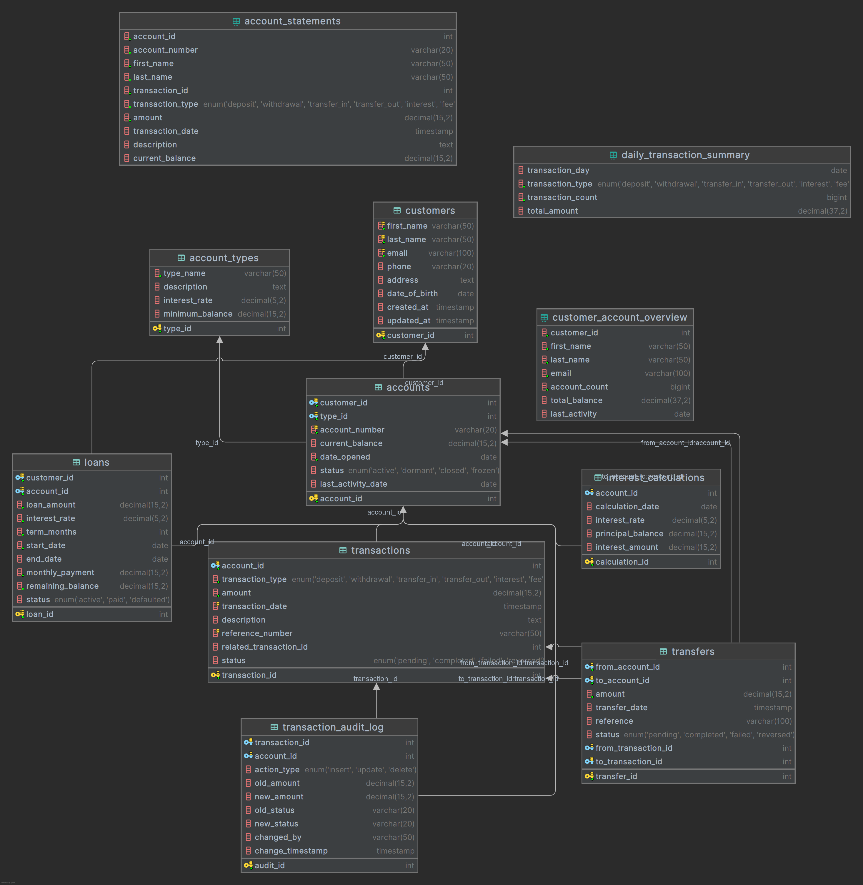
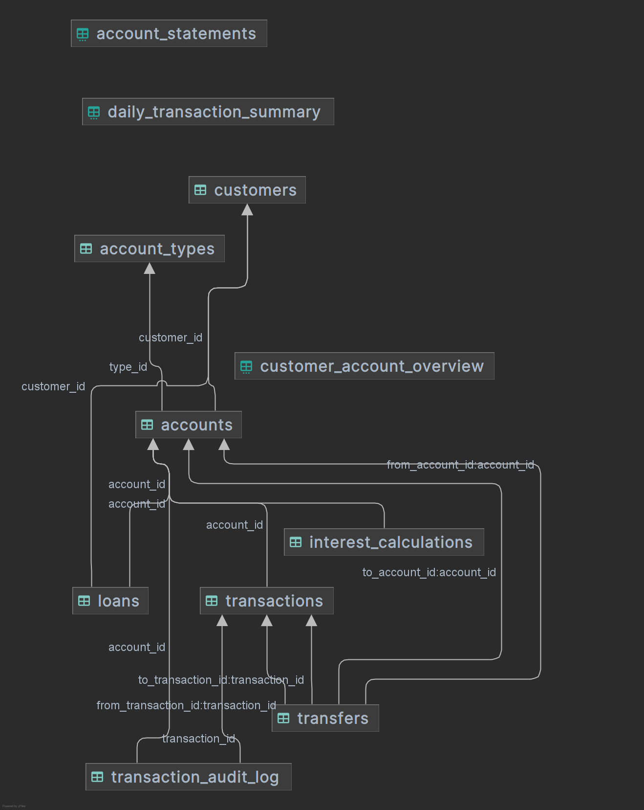

# 🏦 Modern Banking System Database 🏦  

Welcome to the **Modern Banking System Database** – a robust, easy, and scalable database solution designed to handle all core banking operations efficiently. This system supports customer management, account handling, transactions, loans, and more while ensuring data integrity and security.  

---

## 📌 **Key Features**  
✅ **Customer Management** – Store and manage customer details securely.  
✅ **Account Handling** – Support for savings, current, and fixed deposit accounts.  
✅ **Transaction Processing** – Record and track all financial transactions.  
✅ **Loan Management** – Handle loan applications, approvals, and repayments.  
✅ **Security & Authentication** – Secure login and role-based access control.  
✅ **Reporting & Analytics** – Generate financial reports and insights.  

---

## 🗄️ **Database Schema & ER Diagram**  

Below is the **Entity-Relationship (ER) Diagram** representing the core structure of our banking database:  

### **ER Diagram**  




---

## 🛠️ **Database Tables Overview**  

| **Table**       | **Description**                          |
|----------------|------------------------------------------|
| `CUSTOMER`     | Stores customer personal details.        |
| `ACCOUNT`      | Manages bank accounts (Savings, Current, FD). |
| `TRANSACTION`  | Records all financial transactions.      |
| `LOAN`         | Tracks loan details and repayments.      |
| `EMPLOYEE`     | Bank staff with role-based permissions.  |

---

<!-- ## 🔐 **Security Measures**  
- **Encryption**: Sensitive data (passwords, transactions) are encrypted.  
- **Role-Based Access**: Employees have restricted permissions.  
- **Audit Logs**: All critical operations are logged for security.  

--- -->

## 📊 **Sample Queries**  
```sql
-- Make a deposit
CALL make_deposit(1, 500.00, 'Paycheck deposit');

-- Make a withdrawal
CALL make_withdrawal(1, 200.00, 'ATM withdrawal');

-- Transfer between accounts (same customer)
CALL transfer_money(2, 1, 1000.00, 'Savings to checking transfer');

-- Get account statement
SELECT * FROM account_statements WHERE account_id = 1;

-- Check daily transactions
SELECT * FROM daily_transaction_summary WHERE transaction_day = CURRENT_DATE();

-- View customer overview
SELECT * FROM customer_account_overview;
```

---

## 🚀 **Setup & Installation**  
1. **Clone the repository**  
   ```bash
   git clone https://github.com/Pranav128/Banking-system-SQL.git
   ```
2. **Import SQL Schema**  
   ```bash
   mysql -u root -p < banking_schema.sql
   ```
3. **Configure `.env`**  
   ```env
   DB_HOST=localhost
   DB_USER=root
   DB_PASS=yourpassword
   DB_NAME=banking_system
   ```

---

## 🤝 **Contributing**  
Contributions are welcome! Please fork the repo and submit a PR.  

---

## 📜 **License**  
This project is under [**MIT License**](LICENSE).  

---

🌟 **Happy Banking!** 🌟  

---

📅 **Last Updated**: *July 2024*  
👨‍💻 **Developed By**: *Pranav@128*

---
